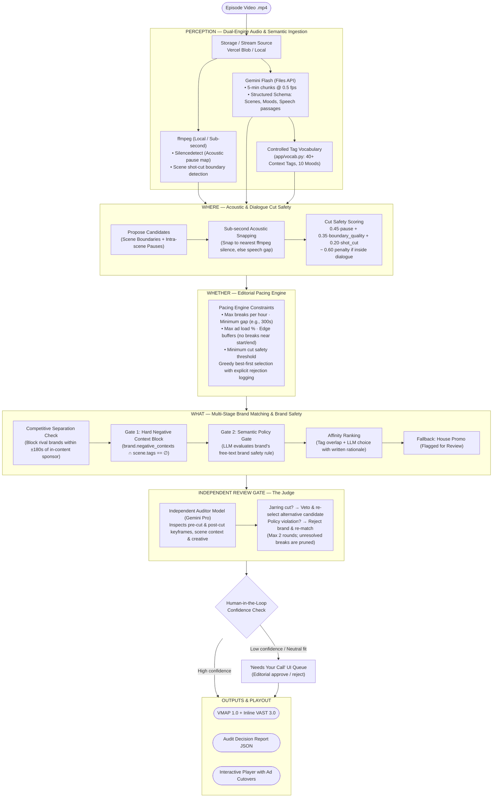

# Joti (জ্যোতি)

<div align="center">

**Context-Aware Video Segmentation & Intelligent Ad-Break Placement for Long-Form OTT Content**

*Developed for the hoichoi Hackathon '26 (Problem 1: Context-Aware Ad Placement)*

[](https://hoichoi-hackathon-sisanta.vercel.app)
[](https://hoichoi-hackathon-sisanta.onrender.com)
[](https://nextjs.org/)
[](https://fastapi.tiangolo.com/)
[](https://deepmind.google/technologies/gemini/)
[](#outputs--standards-compliance)

---

### [🌐 Explore Live Web Demo](https://hoichoi-hackathon-sisanta.vercel.app) · [📖 API Reference](#api-reference) · [⚡ Quickstart](#local-development)

</div>

---

## 💡 Overview

Long-form drama on streaming platforms like **hoichoi** relies on narrative tension, emotional immersion, and rhythmic pacing. Arbitrary time-based ad insertions (e.g., dropping an ad every 7 minutes) catastrophically disrupt the viewer experience:
- Cutting a character off mid-sentence or mid-breath.
- Placing an upbeat snack or tea ad immediately following a tragic death or bereavement scene.
- Running a rival brand ad right next to an in-episode paid product placement.

**Joti** (*Bengali: জ্যোতি — Light / Illumination / Precision Cue*) is an AI-native, production-grade ad-break insertion engine. It analyzes long-form Bengali drama like an expert ad-ops director, methodically answering three foundational questions:

1. **WHERE**: At what exact millisecond is an interruption natural, acoustic, and non-jarring?
2. **WHETHER**: Is a break warranted at this timestamp under editorial pacing rules and ad-load budgets?
3. **WHAT**: Which brand creative belongs in this emotional moment, strictly respecting brand-safety guardrails and competitive separation?

Every placement is fully auditable, backed by written rationales, exported as industry-standard **IAB VMAP 1.0 + VAST 3.0** manifests, and instantly playable via an interactive in-browser video player with real-time ad cutovers.

---

## 🏛️ End-to-End Architecture



---

## ⚙️ Core Technical Pillars

### 1. Dual-Engine Perception (Speed + Precision)
- **Zero Hallucination Timestamping**: Large language models cannot reliably predict millisecond-accurate video cutpoints from raw video tokens alone. Joti runs local, fast **`ffmpeg`** routines (`silencedetect=n=-30dB:d=0.5` and shot boundary detection) in parallel with multimodal ingestion.
- **Ultra-Efficient Multimodal Token Budget**: The video is uploaded **once** via Gemini's Files API and analyzed at **0.5 fps** in 5-minute chunks across 4 concurrent workers. A full 25-minute Bengali drama episode consumes only **~90k tokens** and completes in **~30 seconds** of model time.
- **Controlled Vocabulary Enforcement**: Gemini extracts scene tags strictly constrained to `app/vocab.py` (`CONTEXT_TAGS`, `MOODS`, and `CATEGORY_TAGS`). This makes all downstream brand-safety gating deterministic.
- **Content-Addressable Cache**: Video chunk analyses are hashed (SHA-1 + chunk index + prompt schema version) and cached in `data_local/cache`, enabling instantaneous re-runs of pacing or brand catalogs without re-invoking Gemini.

### 2. WHERE: Cut Safety & Audio Snapping
- **Acoustic Snapping**: Candidates proposed at scene boundaries or intra-scene pauses are snapped to the nearest sub-second silence from the `ffmpeg` acoustic map (10ms precision) or Gemini's speech passage gaps.
- **Speech Protection Formula**:
  $$\text{Cut Safety} = 0.45 \cdot S_{\text{pause}} + 0.35 \cdot S_{\text{boundary}} + 0.20 \cdot S_{\text{shot}} - (0.60 \text{ if inside dialogue})$$
  Any candidate falling within an ongoing speech passage is ruthlessly penalized or discarded. Candidates failing `min_cut_safety` (default: 0.55) are eliminated.

### 3. WHETHER: Dynamic Editorial Pacing
- **Greedy Best-First Allocation**: Evaluates all surviving cut candidates against strict broadcast pacing rules:
  - `max_breaks_per_hour`: Default 6 (scales with episode duration; e.g. 2 breaks for 20-minute episodes, 3 for 26-minute episodes).
  - `min_gap_seconds`: Enforces minimum separation between consecutive breaks (e.g., 300s / 5 minutes).
  - `max_ad_load_pct`: Limits overall commercial saturation (default 10%).
  - `no_break_before_seconds` / `no_break_after_seconds`: Protects narrative openings and cliffhanger endings (default 120s buffer).
- **Auditability**: Every discarded candidate retains an explicit rejection cause (*"less than 5 min from another break"*, *"inside dialogue"*, *"break budget reached"*), visible in the UI inspection drawer.
- **Sub-Second Re-Pacing**: Editors can adjust pacing sliders in the UI and recalculate placements across an entire episode in under 2 seconds without re-processing video.

### 4. WHAT: Multi-Gate Brand Safety & Competitive Separation
- **Gate 1 — Hard Negative Context Block (Set Logic)**:
  $$\text{brand.negative\_contexts} \cap (\text{tags}_{\text{scene\_before}} \cup \text{tags}_{\text{scene\_after}}) = \emptyset$$
  Evaluated purely via mathematical set intersection. No LLM can accidentally talk around a hard block (e.g., placing a food ad after an accident or hospital scene).
- **Gate 2 — Semantic Brand Rule Gate**: Evaluates nuanced natural language safety guidelines defined per brand (e.g., *"never after a scene where characters are too ill or grieving to eat or drink"*).
- **Competitive Separation (±180s)**: Gemini automatically detects in-content brand placements and sponsored segments during ingestion. Joti locks out all competing brands in the same category within a 3-minute window (e.g., an episode promoting *Sunrise Pure Spices* will hard-block rival food/spice ads like *Ghorer Swad* nearby).
- **Affinity Match & Zero-Code Generalization**: Matches surviving brands based on dominant scene activity and mood affinity. Supports registering an arbitrary 9th synthetic brand via API/UI and re-running matching in seconds with **zero code modifications**.

### 5. Independent Review Gate ("The Judge")
- A dedicated, high-reasoning judge model (`Gemini 3.1 Pro`) acts as an external quality assurance editor.
- The judge inspects visual keyframes immediately preceding and following the cutpoint, together with surrounding context and creative metadata.
- **Veto Powers**:
  - Jarring cut detected $\rightarrow$ Vetoes timestamp and triggers candidate re-selection.
  - Brand-context dissonance detected $\rightarrow$ Excludes brand and triggers candidate re-matching.
  - If a slot remains problematic after 2 iteration rounds, the break is dropped entirely.

### 6. Human-in-the-Loop ("Needs Your Call")
- Marginal or borderline-confidence placements (acceptable cut quality, neutral brand fit, or fallback house promo) are flagged as **"Needs Your Call"**.
- Editors can inspect the visual keyframes, read the decision rationale, approve the placement, swap the brand, or delete the break with one click.

---

## 🎨 Synthetic Brand Catalogue

Joti ships with an authentic, culturally resonant synthetic brand catalogue tailored for Bengali regional streaming:

| Brand Name | Category | Tagline | Target Contexts | Hard Negative Contexts |
|---|---|---|---|---|
| **Rongin Cha** | Tea / Beverage | *প্রতিটি আড্ডার সঙ্গী (Every adda's companion)* | family, home, tea, morning, rain, comedy | funeral, death, violence, hospital, disaster |
| **Shonar Tori Jewellers** | Jewellery | *সোনার মতো সম্পর্ক (Bonds as pure as gold)* | wedding, celebration, festival, romance | crime, theft, violence, death, poverty |
| **Ghorer Swad** | Mustard Oil & Spices | *বাংলার খাঁটি স্বাদ (Authentic taste of Bengal)* | kitchen, cooking, eating, food, festival | hospital, illness, death, poverty, hunger |
| **Maya Saree Emporium** | Ethnic Fashion | *ঐতিহ্যে আর আধুনিকতায় (In tradition and modernity)* | wedding, party, celebration, romance | accident, violence, grief, hospital, disaster |
| **Anandadhara Resorts** | Travel & Tourism | *পাহাড় আর সমুদ্রের ডাক (The call of hills & sea)* | travel, road, train, nature, romance | accident, disaster, illness, poverty, tension |
| **Poridhan Daily Wear** | Casual Wear | *রোজকার স্বাচ্ছন্দ্য (Everyday comfort)* | office, school, sports, casual, home | funeral, grief, hospital, disaster |
| **Gramin Shastho Clinic** | Healthcare Diagnostics | *সুস্থ জীবনের প্রতিশ্রুতি (Promise of a healthy life)* | family, morning, village, elderly | alcohol, smoking, violence, party |
| **Shurobhi Agarbatti** | Puja Incense | *ভক্তির পবিত্র সুবাস (Sacred fragrance of devotion)* | religious, morning, family, festival | alcohol, intimacy, party, crime, violence |

---

## 📦 Outputs & Standards Compliance

### 1. IAB VMAP 1.0 Manifest with Inline VAST 3.0
Joti generates fully compliant Video Multiple Ad Playlist (`/jobs/{id}/vmap.xml`) specifications ready for immediate ingestion by standard video players (Video.js, Shaka Player, HLS.js, Google IMA SDK):
```xml
<vmap:VMAP xmlns:vmap="http://www.iab.net/videosuite/vmap" version="1.0">
  <vmap:AdBreak timeOffset="00:08:42.520" breakType="linear" breakId="break-1">
    <vmap:AdSource id="ad-source-1" allowMultipleAds="false" followAdditionalWrapping="true">
      <vmap:VASTData>
        <VAST version="3.0">
          <Ad id="rongin-cha-ad">
            <InLine>
              <AdSystem>Joti Ad Engine</AdSystem>
              <AdTitle>Rongin Cha - Morning Tea</AdTitle>
              <!-- Extension containing full explainability rationale -->
              <Extensions>
                <Extension type="JotiPlacementRationale">
                  Snapped to 820ms acoustic silence; preceding scene: family breakfast adda. No brand-safety conflicts.
                </Extension>
              </Extensions>
              ...
            </InLine>
          </Ad>
        </VAST>
      </vmap:VASTData>
    </vmap:AdSource>
  </vmap:AdBreak>
</vmap:VMAP>
```

### 2. Auditable Decision Report (`debug.json`)
A complete, structured JSON manifest capturing:
- All segmented scenes with start/end timestamps, mood, summary, and assigned vocabulary tags.
- Detailed scoring metrics for every evaluated candidate (snapped timestamps, pause duration, dialogue state, boundary quality, shot cut indicators).
- Complete log of rejected candidates with rejection reasons.
- Brand matching audit trail (passed/failed gates, affinity scores, and written reasoning).
- Keyframe snapshot URLs of pre-cut and post-cut frames.

---

## 🛠️ Tech Stack

| Layer | Technologies & Services | Role |
|---|---|---|
| **Frontend** | **Next.js 16 (App Router)**, **React 19**, **Tailwind CSS v4**, `@base-ui/react`, Lucide Icons | Responsive editor workspace, interactive video player, dark cinematic exhibition UI |
| **Backend API** | **FastAPI**, **Python 3.12**, `uv`, `httpx`, `pydantic v2` | High-throughput asynchronous orchestration API |
| **Media Processing** | **`ffmpeg`**, `ffprobe` | Sub-second acoustic silence detection, shot boundary transitions, keyframe extraction |
| **Multimodal AI** | **Google Gemini Flash** (via Files API) | Low-cost, fast video understanding, scene segmentation, speech transcription |
| **Reasoning & Audit**| **Google Gemini Pro** (or Claude 3.5 Sonnet) | Independent review gate, semantic brand policy auditing, contextual rationale generation |
| **Database & Cache** | **MongoDB Atlas** (or local), SHA-1 Filesystem Cache | User auth, persistent job states, candidates, scene caches, brand catalogues |
| **Video Delivery** | **Vercel Blob** & Local Static Media Storage | Fast streaming playback and chunked uploads |
| **Deployment** | **Vercel** (Frontend) + **Render** (Backend Docker Container) | High-availability cloud deployment with automatic job recovery on restart |

---

## 📁 Repository Layout

```
Joti/
├── backend/
│   ├── app/
│   │   ├── main.py              # FastAPI application, lifecycle management & endpoints
│   │   ├── config.py            # Global configuration, model selection, defaults
│   │   ├── auth.py              # Scrypt password hashing & JWT authentication
│   │   ├── store.py             # MongoDB persistence & filesystem fallback store
│   │   ├── vocab.py             # Controlled CONTEXT_TAGS, MOODS & CATEGORY_TAGS
│   │   └── pipeline/
│   │       ├── audio.py         # ffmpeg silence mapping, shot detection, keyframes
│   │       ├── gemini.py        # Gemini Files API chunking, schema enforcement & retry logic
│   │       ├── scoring.py       # WHERE (snapping & safety) & WHETHER (pacing engine)
│   │       ├── matching.py      # WHAT (hard negative block, LLM policy, affinity ranker)
│   │       ├── judge.py         # Independent review gate & keyframe validation
│   │       ├── vmap.py          # IAB VMAP 1.0 & VAST 3.0 XML serializer
│   │       └── run.py           # End-to-end pipeline execution coordinator
│   ├── data/
│   │   └── brands.json          # Synthetic brand catalogue with Bengali brand profiles
│   ├── scripts/
│   │   └── run_local.py         # Standalone CLI runner for processing local video files
│   ├── pyproject.toml           # uv project definition and dependencies
│   └── Dockerfile               # Production Dockerfile with ffmpeg & Python 3.12
│
├── frontend/
│   ├── src/
│   │   ├── app/
│   │   │   ├── page.tsx         # "Digital Archive" cinematic exhibition landing page
│   │   │   ├── episodes/        # Episode ingestion, real-time analytics & upload modal
│   │   │   ├── jobs/[id]/       # Interactive episode editor, player, and break approval drawer
│   │   │   └── brands/          # Brand catalogue management & creative preview
│   │   ├── components/
│   │   │   ├── player/          # Custom HTML5 video player with ad cutovers & cue markers
│   │   │   ├── PacingControls.tsx # Interactive pacing sliders & dynamic re-placement
│   │   │   └── AuthForm.tsx     # Sign up & login forms
│   │   └── lib/                 # API client, JWT storage, Vercel Blob client
│   ├── package.json             # Next.js 16 + React 19 dependencies
│   └── tailwind.config.ts       # Tailwind CSS v4 design system tokens
│
├── docs/                        # Problem statement, judging criteria & participant handbook
└── render.yaml                  # Render Infrastructure-as-Code blueprint
```

---

## 🚀 Local Development

### Prerequisites
- **Python 3.12+** with [`uv`](https://docs.astral.sh/uv/) installed
- **Node.js 20+** with [`pnpm`](https://pnpm.io/)
- **ffmpeg** installed and accessible on your system `PATH`
- A **Google Gemini API Key** ([Google AI Studio](https://aistudio.google.com/))

### 1. Backend Setup

```bash
cd backend

# Create environment configuration
cp .env.example .env
```

Configure `backend/.env`:
```ini
GEMINI_API_KEY=your_gemini_api_key_here
# Optional: MongoDB connection (defaults to local JSON storage if omitted)
MONGODB_URI=mongodb://localhost:27017
MONGODB_DB_NAME=joti
JWT_SECRET=super_secret_jwt_key
CORS_ORIGINS=http://localhost:3000
```

Install dependencies and start the backend:
```bash
# Sync virtualenv and dependencies with uv
uv sync

# Launch the FastAPI dev server
uv run uvicorn app.main:app --reload --port 8000
```
Backend API will be accessible at `http://localhost:8000` (Interactive docs at `http://localhost:8000/docs`).

#### Running Headless CLI Mode:
You can run the entire segmentation and ad placement pipeline on a local MP4 file without running the web server:
```bash
uv run python scripts/run_local.py path/to/bhojon_bilashi_ep01.mp4
```

---

### 2. Frontend Setup

```bash
cd ../frontend

# Install dependencies
pnpm install

# Configure environment variables
cat <<EOF > .env.local
NEXT_PUBLIC_API_URL=http://localhost:8000
EOF

# Launch Next.js dev server
pnpm dev
```
Open [http://localhost:3000](http://localhost:3000) in your browser.

---

## 📡 API Reference

All `/jobs` and `/brands` endpoints require an `Authorization: Bearer <token>` header (obtained via `/auth/login` or `/auth/signup`).

| Method | Endpoint | Description |
|---|---|---|
| `POST` | `/auth/signup` | Register a new user (`{username, password}`) |
| `POST` | `/auth/login` | Authenticate and obtain 7-day HS256 JWT |
| `GET` | `/auth/me` | Fetch currently authenticated user profile |
| `GET` | `/pacing` | Retrieve default pacing configuration rules |
| `GET` | `/vocab` | List controlled `CONTEXT_TAGS`, `MOODS`, and `CATEGORY_TAGS` |
| `POST` | `/jobs` | Start video analysis job via URL (`{url, title, pacing}`) |
| `POST` | `/jobs/upload` | Start video analysis via direct multipart file upload |
| `GET` | `/jobs` | List all analysis jobs belonging to the authenticated user |
| `GET` | `/jobs/{id}` | Get full job details (scenes, breaks, rejected candidates, progress) |
| `POST` | `/jobs/{id}/place` | **Re-run scoring & matching** in seconds with updated pacing rules |
| `POST` | `/jobs/{id}/breaks/{break_id}` | Approve a held break (`action: "insert"`) or remove it (`action: "remove"`) |
| `POST` | `/jobs/{id}/retry` | Retry a failed analysis job |
| `DELETE` | `/jobs/{id}` | Delete a job and purge associated media caches |
| `GET` | `/jobs/{id}/vmap.xml` | Export standards-compliant **IAB VMAP 1.0 XML** manifest |
| `GET` | `/jobs/{id}/debug.json` | Export exhaustive audit report with scene data and rejection logs |
| `GET` | `/brands` | Retrieve user's brand catalogue |
| `POST` | `/brands` | Register a new brand (supports 9th unseen brand test) |
| `DELETE`| `/brands/{brand_id}` | Remove a brand from the catalogue |

---

## 🛡️ Reliability & Fault Tolerance

1. **Transient 503 & Rate Limit Resilience**: Gemini free and paid tiers experience occasional high-demand surges. The `gemini.generate` wrapper automatically rotates across fallback model variants (`gemini-3.8-flash`, `gemini-3.7-flash`, `gemini-3.5-flash`, `gemini-3.5-flash-lite`) with exponential backoff.
2. **Stateless Crash Recovery**: If the backend container restarts on Render during an in-flight video analysis, `_resume_interrupted()` detects active jobs on boot, re-fetches the video from storage, and resumes execution seamlessly.
3. **Pacing Isolation**: Scoring and matching are strictly separated from perception. You can re-run placements, test new brand catalogs, or tweak break limits infinitely without repeating video upload or Gemini analysis.

---

## 👥 Authors & Acknowledgments

- **Built by**: [Aritra Roy](https://github.com/Aritra7070)
- **Hackathon**: [hoichoi](https://www.hoichoi.tv/) Hackathon '26
- **Problem Statement**: Problem 1 — *Context-Aware Video Segmentation & Intelligent Ad Placement*
- **License**: MIT
